# mercan-exercicio-pratico

Repository created for the Mercan hiring process as a technical exercise to be presented.

**Expense Reports API** — a multi-tenant ASP.NET Core 8 Web API for employee expense submission and manager approval. Each tenant has its own employees, monthly expense limits, and isolated data. Authentication uses JWT tokens issued after tenant-scoped login via ASP.NET Identity.

---

## Table of Contents
- [Answers About Decisions](#answers-about-decisions)
- [Solution Overview](#solution-overview)
- [Getting Started](#getting-started)
- [Architecture](#architecture)
- [Endpoints](#endpoints)
  - [Error Response Shapes](#error-response-shapes)
  - [Enum Reference](#enum-reference)
  - [GET /healthz](#get-healthz)
  - [POST /api/auth/login](#post-apiauthlogin)
  - [POST /api/auth/register](#post-apiauthregister)
  - [GET /api/expenses/pending](#get-apiexpensespending)
  - [POST /api/expenses](#post-apiexpenses)
  - [POST /api/expenses/id/approve](#post-apiexpensesidapprove)
  - [POST /api/expenses/id/reject](#post-apiexpensesidreject)
  - [GET /api/expenses (list)](#get-apiexpenses)
  - [GET /api/expenses/id (details)](#get-apiexpensesid)
- [Services (Application Layer)](#services-application-layer)
- [Infrastructure and Domain Layers](#infrastructure-and-domain-layers)
  - [Domain Layer](#domain-layer)
  - [Infrastructure Layer](#infrastructure-layer)
- [Sequence Diagrams](#sequence-diagrams)
- [Testing](#testing)

---

## Answers About Decisions
The priority was to build a concise architecture, robust enought to accept future feature development with minimal effort and impact. 
Then building a robust business core, with complete validations and domain business logic oriented to atomize the business rules of each domain model.
(P.S: Only domain specific business rules are implemented in the domain level, rules involving multiple domain models are implemented in custom validators at the application layer.)

With more time available, other aspects of the solution could be improved like: Idempotency, CQRS (Not implemented due the simplicity of the business objects and transactions),
Api versioning, Modular based architecture (allows future split in microservices if needed) among other things.

I'm proud of the architecture I was able to implement in only 2 and a half days (In parallel with normal work activities). 
There's a lot of room for improvement, but I did the best I could with the time I had available.

I feel I could improve the overall object orientation, use more generic approaches and abstractions, create more automated routines and get rid of a couple of switch statemens across the solution.
Also improving the domain layer to more business rich would be a good point to start, too much of the business logic is validated on validators, some of them could be don in domain level with more time for refinement.

## Solution Overview

| Project | Role |
|---------|------|
| `ER.WebApi` | HTTP API — controllers, middleware, AutoMapper, Swagger, health checks |
| `ER.Application` | Use cases — services, FluentValidation validators, `Result<T>` pattern, repository interfaces |
| `ER.Domain` | Business entities, enums, specifications, domain rules, configuration POCOs |
| `ER.Infrastructure` | EF Core + PostgreSQL, ASP.NET Identity, repository implementations, seeds, migrations |
| `ER.Application.UnitTests` | Unit tests for validators and application services |
| `ER.IntegrationTests` | End-to-end tests via `WebApplicationFactory` |
| `ER.Domain.UnitTests` | Domain unit tests |
| `ER.Infrastructure.UnitTests` | Infrastructure unit tests |
| `ER.WebApi.UnitTests` | Web API unit tests |

Solution file: `ExpenseReports.sln`

---

## Getting Started

### Prerequisites

- [.NET 8 SDK](https://dotnet.microsoft.com/download/dotnet/8.0)
- PostgreSQL (connection string in `ER.WebApi/appsettings.json`)

### Run the API

```powershell
cd ER.WebApi
dotnet run
```

Swagger UI is available in Development at `/swagger`.

Enable sample data by setting `DatabaseSettings:SeedSampleData` to `true` in `appsettings.json` (or `appsettings.Development.json`).

### Sample Credentials (seed data)

| Field | Value |
|-------|-------|
| Default password | `SeedPass1!` |
| Acme tenant ID | `11111111-1111-1111-1111-111111111101` |
| Globex tenant ID | `11111111-1111-1111-1111-111111111102` |
| Acme manager | `manager@acme.com` — employee ID `22222222-2222-2222-2222-222222222201` |
| Acme employee 1 | `employee1@acme.com` — employee ID `22222222-2222-2222-2222-222222222202` |
| Acme employee 2 | `employee2@acme.com` — employee ID `22222222-2222-2222-2222-222222222203` |

All endpoint samples below use the **Acme** tenant unless noted otherwise.

### Authenticated Requests

After login, include the JWT in every protected request:

```http
Authorization: Bearer {accessToken}
```

---

## Architecture

The solution follows **Clean Architecture** with strict dependency direction: outer layers depend on inner abstractions, never the reverse.

| Layer | Project | Responsibility |
|-------|---------|----------------|
| Presentation | `ER.WebApi` | HTTP pipeline, controllers, request/response contracts, AutoMapper, middleware |
| Application | `ER.Application` | Use cases, validation, orchestration, repository **interfaces** |
| Domain | `ER.Domain` | Entities, enums, specifications, domain behavior |
| Infrastructure | `ER.Infrastructure` | Persistence (EF Core + PostgreSQL), Identity, repository implementations |

`ER.Application` references `ER.Domain` only. `ER.Infrastructure` references both `ER.Application` and `ER.Domain` and implements Application repository contracts at runtime. `ER.WebApi` wires everything together in `Program.cs`.

### Architecture Diagram

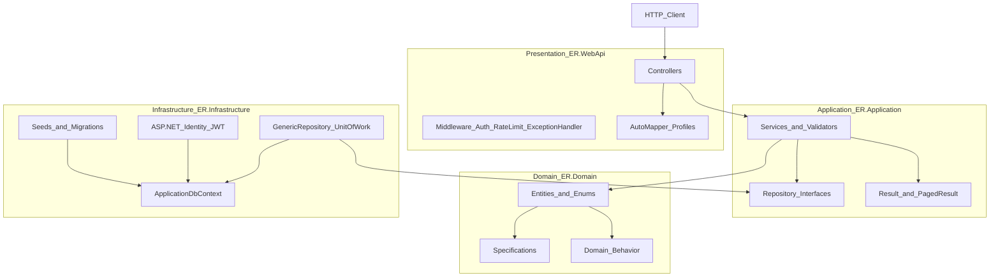

### Patterns Used

| Pattern | Description | Key files |
|---------|-------------|-----------|
| **Repository + Unit of Work** | Generic data access with transactional boundaries | `IUnitOfWork`, `IGenericRepository<T>`, `UnitOfWork`, `GenericRepository<T>` |
| **Result envelope** | Operations return `Result<T>` / `PagedResult<T>` with typed errors mapped to HTTP by controllers | `Result.cs`, `BaseController.cs` |
| **Specification + factory** | Immutable specification records feed static `Create()` methods on domain entities | `*Specification.cs`, `Tenant.Create()`, `Expense.Create()` |
| **FluentValidation** | Service-layer validators implement `IServiceValidator<T, TResult>` | `ServiceValidator.cs`, `LoginValidator.cs`, etc. |
| **JWT + Identity multi-tenancy** | Tenant-scoped usernames (`{tenantId}:{email}`), shared PK between `Employee` and `ApplicationUser` | `Infrastructure/DI/Setup.cs` |
| **Structured logging** | Source-generated `LoggerMessage` helpers per layer | `ApplicationLogs`, `ApiLogs`, `InfrastructureLogs` |
| **Login rate limiting** | Sliding-window limiter per client IP on `POST /api/auth/login` | `RateLimitingStartupConfiguration.cs` |
| **Problem Details** | Validation and unexpected errors return RFC 7807-style JSON (no stack traces) | `Program.cs`, `BaseController.cs` |

### HTTP Pipeline Order

Configured in `ER.WebApi/Program.cs`:

1. Exception handler (returns generic 500 Problem Details)
2. Health checks (`/healthz`)
3. Swagger / Swagger UI (Development only)
4. HTTPS redirection (non-Testing environments)
5. Request trace scope
6. Rate limiter
7. Authentication (JWT Bearer)
8. Authorization
9. Controllers

Infrastructure DI is registered before Application DI so `IUnitOfWork`, `UserManager<ApplicationUser>`, and `IHttpContextAccessor` resolve correctly.

---

## Endpoints

All JSON uses **camelCase** property names (ASP.NET default). Enums are serialized as **integers** unless configured otherwise.

### Endpoint Summary

| # | Method | Path | Auth | Success |
|---|--------|------|------|---------|
| 1 | GET | `/healthz` | None | 200 / 503 |
| 2 | POST | `/api/auth/login` | None (rate limited) | 200 |
| 3 | POST | `/api/auth/register` | None | 201 |
| 4 | GET | `/api/expenses/pending` | JWT | 200 |
| 5 | POST | `/api/expenses` | JWT | 200 |
| 6 | POST | `/api/expenses/{id}/approve` | JWT | 200 |
| 7 | POST | `/api/expenses/{id}/reject` | JWT | 200 |
| 8 | GET | `/api/expenses` | JWT | 200 |
| 9 | GET | `/api/expenses/{id}` | JWT | 200 |

---

### Error Response Shapes

| Status | When | Body shape |
|--------|------|------------|
| **400** | Validation failure | FluentValidation errors or `{ "message": "..." }` |
| **401** | Missing/invalid JWT, or login rejected | `{ "message": "Invalid credentials." }` |
| **403** | Manager-only rule violated | `{ "message": "User needs to be a manager." }` |
| **404** | Resource not found or empty collection | `{ "message": "Expense not found." }` or empty 404 |
| **429** | Login rate limit exceeded | `application/problem+json` + `Retry-After` header |
| **500** | Unexpected server error | `{ "message": "An unexpected error occurred." }` or Problem Details |
| **503** | Health check unhealthy (DB down) | JSON health report with `status: "Unhealthy"` |

Validation errors from DataAnnotations (request models) return `ValidationProblemDetails`:

```json
{
  "type": "https://tools.ietf.org/html/rfc9110#section-15.5.1",
  "title": "One or more validation errors occurred.",
  "status": 400,
  "errors": {
    "Description": ["The field Description must be a string with a minimum length of 50."]
  }
}
```

---

### Enum Reference

| Enum | Values |
|------|--------|
| `Currency` | `1` = BRL, `2` = EUR, `3` = USD |
| `ExpenseCategory` | `1` = Meal, `2` = Transport, `3` = Lodging, `4` = Other |
| `ExpenseStatus` | `1` = Pending, `2` = Approved, `3` = Rejected |
| `EmployeeRole` | `1` = Employee, `2` = Manager |

---

### GET /healthz

Liveness and readiness probe. Anonymous.

**Request**

```http
GET /healthz
```

**Response 200** — API and PostgreSQL healthy

```json
{
  "status": "Healthy",
  "totalDuration": 42.5,
  "entries": {
    "self": {
      "status": "Healthy",
      "description": "API is running",
      "duration": 0.1,
      "tags": ["live"]
    },
    "postgresql": {
      "status": "Healthy",
      "description": null,
      "duration": 42.0,
      "tags": ["db", "ready"]
    }
  }
}
```

**Response 503** — Database unreachable (same JSON shape with `"status": "Unhealthy"`).

| Code | Meaning |
|------|---------|
| 200 | Healthy or Degraded |
| 503 | Unhealthy |

---

### POST /api/auth/login

Authenticates an employee within a tenant and returns a JWT. Rate limited (default: 10 requests/minute per IP).

**Request**

```http
POST /api/auth/login
Content-Type: application/json
```

```json
{
  "tenantId": "11111111-1111-1111-1111-111111111101",
  "email": "employee1@acme.com",
  "password": "SeedPass1!"
}
```

**Response 200**

```json
{
  "accessToken": "eyJhbGciOiJIUzI1NiIsInR5cCI6IkpXVCJ9...",
  "expiresAt": "2026-06-08T13:30:00.0000000Z"
}
```

**Response 401** — invalid credentials

```json
{
  "message": "Invalid credentials."
}
```

**Response 429** — rate limit exceeded

```json
{
  "type": "https://tools.ietf.org/html/rfc6585#section-4",
  "title": "Too many login attempts.",
  "status": 429,
  "detail": "Login rate limit exceeded. Please try again later."
}
```

Header: `Retry-After: 60`

| Code | Meaning |
|------|---------|
| 200 | Login successful |
| 400 | Validation failure (missing tenantId, email, or password) |
| 401 | Invalid credentials |
| 429 | Rate limit exceeded |
| 500 | Unexpected error |

---

### POST /api/auth/register

Registers a new employee and linked Identity user within a tenant.

**Request**

```http
POST /api/auth/register
Content-Type: application/json
```

```json
{
  "tenantId": "11111111-1111-1111-1111-111111111101",
  "name": "New Employee",
  "email": "new.employee@acme.com",
  "password": "SecurePass1!",
  "role": 1
}
```

**Response 201**

```json
{
  "employeeId": "aaaaaaaa-bbbb-cccc-dddd-eeeeeeeeeeee",
  "userId": "aaaaaaaa-bbbb-cccc-dddd-eeeeeeeeeeee"
}
```

Note: `employeeId` and `userId` are the same GUID (shared primary key between `Employee` and `ApplicationUser`).

**Response 400** — validation or business failure

```json
{
  "message": "User creation failed."
}
```

| Code | Meaning |
|------|---------|
| 201 | Registration successful |
| 400 | Validation failure, inactive tenant, email taken, or Identity creation failed |
| 500 | Unexpected error |

---

### GET /api/expenses/pending

Returns all **Pending** expenses for the authenticated user's tenant. Intended for managers reviewing submissions.

**Request**

```http
GET /api/expenses/pending
Authorization: Bearer {accessToken}
```

**Response 200**

```json
{
  "expenses": [
    {
      "id": "33333333-3333-3333-3333-333333333301",
      "tenantId": "11111111-1111-1111-1111-111111111101",
      "employeeId": "22222222-2222-2222-2222-222222222202",
      "amount": 150.00,
      "expenseDate": "2026-06-01",
      "submittedAt": "2026-06-01T10:00:00Z",
      "employeeName": "Acme Employee One",
      "currency": 1,
      "category": 1,
      "description": "Business lunch with client at downtown restaurant.",
      "status": 1
    }
  ]
}
```

**Response 404** — no pending expenses (empty list).

| Code | Meaning |
|------|---------|
| 200 | Pending expenses returned |
| 401 | Missing or invalid JWT |
| 404 | No pending expenses |
| 500 | Unexpected error |

---

### POST /api/expenses

Submits a new expense with status **Pending**. JWT tenant and employee must match the request body.

**Request**

```http
POST /api/expenses
Authorization: Bearer {accessToken}
Content-Type: application/json
```

```json
{
  "id": null,
  "tenantId": "11111111-1111-1111-1111-111111111101",
  "employeeId": "22222222-2222-2222-2222-222222222202",
  "amount": 89.50,
  "expenseDate": "2026-06-05",
  "submittedAt": "2026-06-05T14:30:00Z",
  "employeeName": "Acme Employee One",
  "currency": 1,
  "category": 2,
  "description": "Taxi fare from airport to client office downtown.",
  "status": 1
}
```

**Response 200** — empty body.

**Response 400** — validation failure (description must be 50–500 characters, amount positive, dates valid, JWT binding mismatch, duplicate expense, etc.).

| Code | Meaning |
|------|---------|
| 200 | Expense submitted |
| 400 | Validation or business rule failure |
| 401 | Missing or invalid JWT |
| 500 | Unexpected error |

---

### POST /api/expenses/{id}/approve

Approves a pending expense. Caller must be a **Manager** in the same tenant. Cannot approve own expense. Monthly tenant limit is enforced.

**Request**

```http
POST /api/expenses/33333333-3333-3333-3333-333333333301/approve
Authorization: Bearer {accessToken}
```

No request body.

**Response 200** — empty body.

**Response 400** — not pending, monthly limit exceeded, or other business rule.

```json
{
  "message": "This approval is not possible. Reason: It exceeds the Monthly Expense Limit for the Tenant: ... and Employee: ..."
}
```

**Response 403** — caller is not a manager.

```json
{
  "message": "User needs to be a manager."
}
```

**Response 404**

```json
{
  "message": "Expense not found."
}
```

| Code | Meaning |
|------|---------|
| 200 | Expense approved |
| 400 | Business rule failure (not pending, limit exceeded, self-approval) |
| 401 | Missing or invalid JWT |
| 403 | Caller is not a manager |
| 404 | Expense not found |
| 500 | Unexpected error |

---

### POST /api/expenses/{id}/reject

Rejects a pending expense with a reason.

**Request**

```http
POST /api/expenses/33333333-3333-3333-3333-333333333301/reject
Authorization: Bearer {accessToken}
Content-Type: application/json
```

```json
{
  "rejectReason": "Receipt is missing and the expense category does not match the submitted documentation."
}
```

Reject reason must be **10–500 characters**.

**Response 200** — empty body.

| Code | Meaning |
|------|---------|
| 200 | Expense rejected |
| 400 | Validation failure, not pending, or business rule |
| 401 | Missing or invalid JWT |
| 403 | Caller is not a manager |
| 404 | Expense not found |
| 500 | Unexpected error |

---

### GET /api/expenses

Returns a paginated list of **Pending** expenses for the authenticated user's tenant.

**Request**

```http
GET /api/expenses?currentPage=1&rowsPerPage=20&orderBy=Id&order=asc
Authorization: Bearer {accessToken}
```

| Query param | Default | Constraints |
|-------------|---------|-------------|
| `currentPage` | 1 | ≥ 1 |
| `rowsPerPage` | 20 | 1–100 |
| `orderBy` | `Id` | Non-empty, max 100 chars |
| `order` | `asc` | `asc` or `desc` (case-insensitive) |

**Response 200**

```json
[
  {
    "id": "33333333-3333-3333-3333-333333333301",
    "tenantId": "11111111-1111-1111-1111-111111111101",
    "employeeId": "22222222-2222-2222-2222-222222222202",
    "amount": 150.00,
    "expenseDate": "2026-06-01",
    "submittedAt": "2026-06-01T10:00:00Z",
    "employeeName": "Acme Employee One",
    "currency": 1,
    "category": 1,
    "description": "Business lunch with client at downtown restaurant.",
    "status": 1
  }
]
```

**Response 404** — no expenses match (empty page).

| Code | Meaning |
|------|---------|
| 200 | Expenses returned |
| 400 | Pagination validation failure |
| 401 | Missing or invalid JWT |
| 404 | No expenses found |
| 500 | Unexpected error |

---

### GET /api/expenses/{id}

Returns detailed expense information scoped to the authenticated user's tenant.

**Request**

```http
GET /api/expenses/33333333-3333-3333-3333-333333333301
Authorization: Bearer {accessToken}
```

**Response 200**

```json
{
  "id": "33333333-3333-3333-3333-333333333301",
  "tenantId": "11111111-1111-1111-1111-111111111101",
  "employeeId": "22222222-2222-2222-2222-222222222202",
  "amount": 150.00,
  "expenseDate": "2026-06-01",
  "submittedAt": "2026-06-01T10:00:00Z",
  "tenant": {
    "id": "11111111-1111-1111-1111-111111111101",
    "name": "Acme Corp",
    "monthlyExpenseLimit": 10000.00,
    "isActive": true
  },
  "employee": {
    "id": "22222222-2222-2222-2222-222222222202",
    "tenantId": "11111111-1111-1111-1111-111111111101",
    "name": "Acme Employee One",
    "email": "employee1@acme.com",
    "role": 1,
    "isActive": true,
    "tenant": null
  },
  "currency": 1,
  "category": 1,
  "status": 1,
  "description": "Business lunch with client at downtown restaurant.",
  "decidedAt": null,
  "decidedByEmployeeId": null,
  "rejectionReason": null,
  "decidedBy": null
}
```

Cross-tenant access returns **404** (tenant isolation).

| Code | Meaning |
|------|---------|
| 200 | Expense details returned |
| 401 | Missing or invalid JWT |
| 404 | Expense not found (or different tenant) |
| 500 | Unexpected error |

---

## Services (Application Layer)

The Application layer (`ER.Application`) contains all use-case logic. Controllers remain thin: they log, call an `I*Service`, and map `Result<T>` to HTTP via `BaseController`.

### Connection to the API

Registration in `ER.Application/DI/Setup.cs`, invoked from `Program.cs` **after** Infrastructure DI:

```csharp
builder.Services.ConfigureInfrastructureDependencyInjection(builder.Configuration);
builder.Services.ConfigureApplicationDependencyInjection(builder.Configuration);
```

Controllers inject service interfaces (e.g. `IExpensesService`) — never concrete implementations or repositories directly.

### Service Catalog

| Interface | Implementation | Purpose | Returns |
|-----------|----------------|---------|---------|
| `IAuthenticationService` | `AuthenticationService` | Tenant-scoped login via Identity + JWT issuance | `Result<LoginResponse>` |
| `IEmployeeRegistrationService` | `EmployeeRegistrationService` | Atomic employee + Identity user registration | `Result<RegisterEmployeeResult>` |
| `ITokenGeneratorService` | `JwtTokenGeneratorService` | Signs JWT with tenant, employee, role claims | `string?` token |
| `ICurrentUserService` | `CurrentUserService` | Reads JWT claims from `HttpContext` | Properties: `TenantId`, `EmployeeId`, `Role` |
| `IExpensesService` | `ExpensesService` | Full expense lifecycle (list, submit, approve, reject, detail) | `Result<T>` / `PagedResult<T>` |

### Validators

| Validator | Validates |
|-----------|-----------|
| `LoginValidator` | `LoginRequest` |
| `EmployeeRegistrationValidator` | `RegisterEmployeeRequest` |
| `SubmitExpenseValidator` | `SubmitExpenseRequestDto` (includes JWT tenant/employee binding) |
| `ExpenseStatusChangeValidator` | `ChangeExpenseStatusDto` + loaded `Expense` (manager, tenant, pending status) |
| `PaginationValidator` | `PaginationRequestDto` |

Validators implement `IServiceValidator<T, TResult>` or `IServiceValidatorModelComparer<T, TModel, TResult>`. On failure they populate `Result.Validation` (FluentValidation) without throwing.

### Operation Flow

Every service method follows a consistent logging pattern via `ApplicationLogs`:

1. `OperationStarted` — method entry with tenant/employee context
2. Business logic (validation → repository/UoW → domain rules)
3. `OperationCompleted` on success, `OperationRejected` on expected failures, `OperationFailedUnexpectedly` on caught exceptions
4. Unexpected exceptions set `ErrorType.Exception` with `OperationMessages.UnexpectedError` (never raw exception messages to callers)

### Application Layer Class Diagram

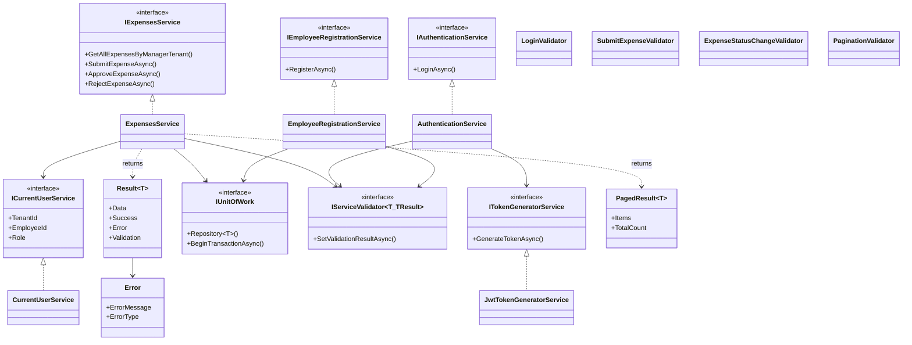

---

## Infrastructure and Domain Layers

### Domain Layer

**Project:** `ER.Domain` — no dependencies on Application or Infrastructure.

#### Entity Hierarchy

```
BaseModel (Id)
├── Model (Name, IsActive)
│   ├── Tenant (MonthlyExpenseLimit)
│   └── Employee (TenantId, Email, Role)
└── Expense (Amount, Status, ExpenseDate, ...)
```

`ApplicationUser` extends `IdentityUser<Guid>` with `TenantId` and a 1:1 navigation to `Employee` via **shared primary key** (`ApplicationUser.Id == Employee.Id`).

#### Multi-Tenancy

Every business entity carries `TenantId`. Login resolves users by `{tenantId}:{email}`. Expense queries always filter by the authenticated tenant.

#### Specifications and Factories

Entities are created through immutable specification records:

| Specification | Entity |
|---------------|--------|
| `TenantSpecification` | `Tenant.Create()` |
| `EmployeeSpecification` | `Employee.Create()` |
| `ExpenseSpecification` | `Expense.Create()` |
| `ApplicationUserSpecification` | `ApplicationUser.Create()` |

#### Domain Behavior

- `Expense.SetApprovalDetails(status, deciderId, rejectionReason?)` — records approval/rejection metadata
- `Expense.ValidateApprovalAmount(totalApprovedInMonth)` — enforces tenant monthly limit before approval

#### Configuration POCOs

| Class | Section | Purpose |
|-------|---------|---------|
| `JwtSettings` | `Jwt` | Issuer, audience, signing key, expiry |
| `DatabaseSettings` | `DatabaseSettings` | Drop DB flag, seed sample data flag |
| `LoginRateLimitSettings` | `LoginRateLimit` | Rate limit policy configuration |

#### Domain Class Diagram

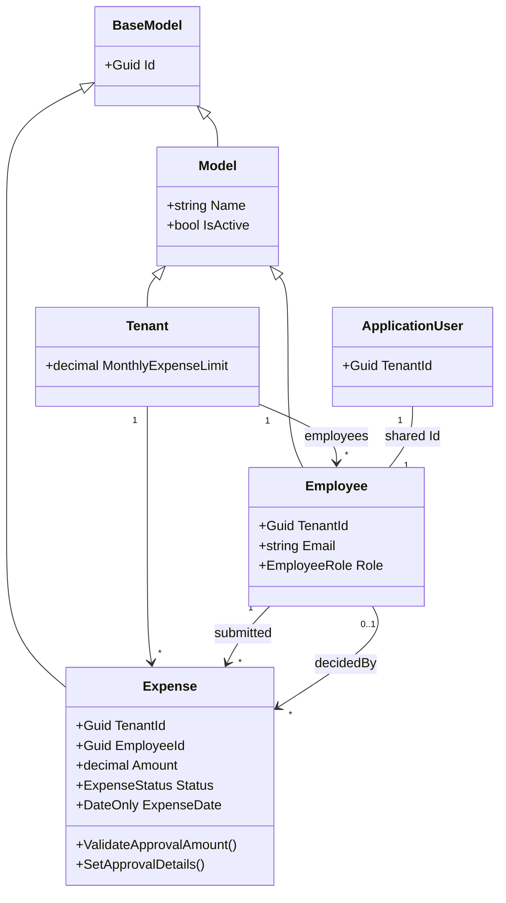

---

### Infrastructure Layer

**Project:** `ER.Infrastructure` — implements persistence, Identity, and seeds.

#### DbContext and Configurations

- `ApplicationDbContext` extends `IdentityDbContext<ApplicationUser, IdentityRole<Guid>, Guid>`
- Fluent configurations in `Configurations/` define constraints, indexes, and delete behaviors (Restrict on business FKs, Cascade on Identity user)

#### Repositories

| Class | Implements | Role |
|-------|------------|------|
| `UnitOfWork` | `IUnitOfWork` | Repository factory, transactions, SaveChanges |
| `GenericRepository<T>` | `IGenericRepository<T>` | CRUD, filtered queries, pagination with sort whitelist |
| `TenantRepository` | `ITenantRepository` | `ExistsActiveAsync(tenantId)` |

#### Identity and JWT

Configured in `Infrastructure/DI/Setup.cs`:

- Password policy: digit, upper, lower, special, min 8 chars
- Lockout: 5 failed attempts / 15 minutes
- JWT Bearer authentication with symmetric HMAC-SHA256 key
- Authorization policy `ManagerOnly` (defined but enforced primarily via validators)

#### Seeds and Migrations

- `ApplicationDbContextInitializer` — optional dev table drop, migrate, seed
- `SampleDataSeeder` — seeds Acme and Globex tenants with 3 users each
- Initial migration: `20260608052352_InitialIdentityAndDomain`

#### Infrastructure Class Diagram

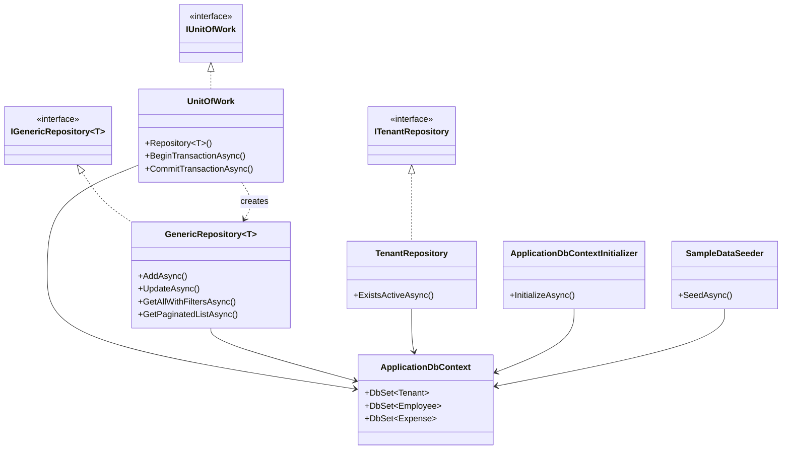

---

## Sequence Diagrams

### Sequence: GET /healthz

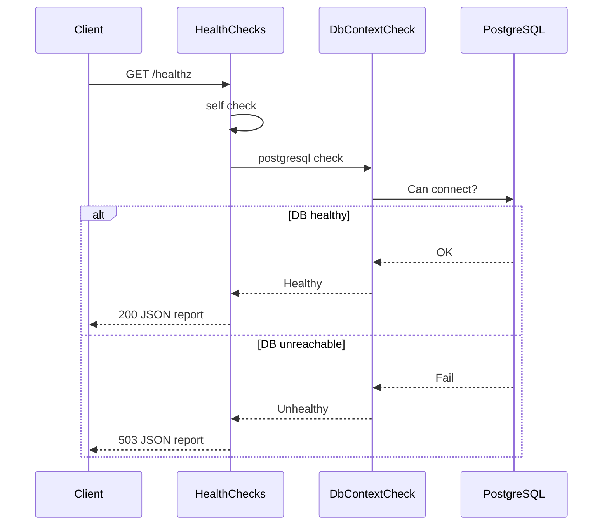

### Sequence: POST /api/auth/login

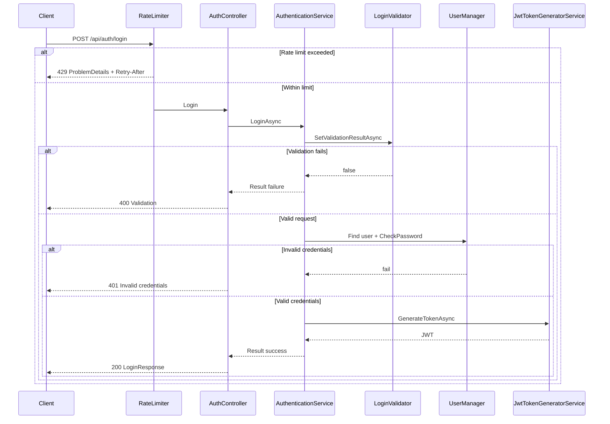

### Sequence: POST /api/auth/register

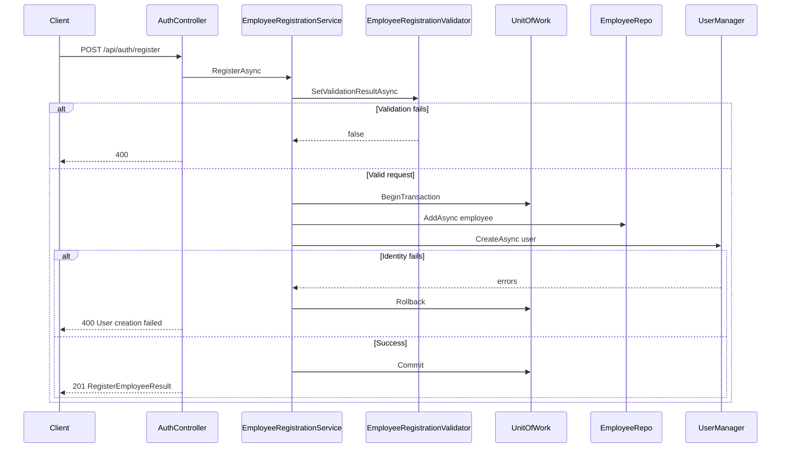

### Sequence: GET /api/expenses/pending

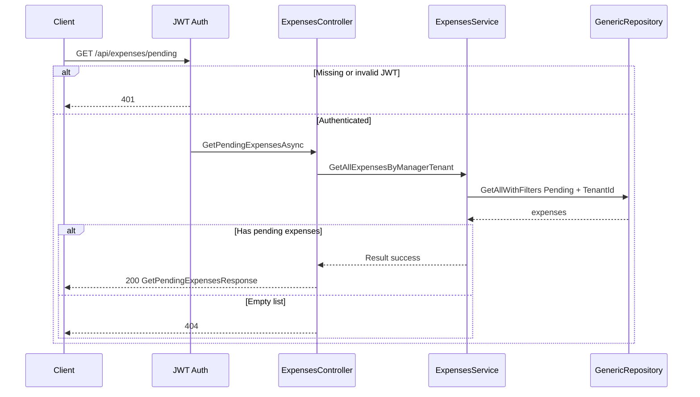

### Sequence: POST /api/expenses

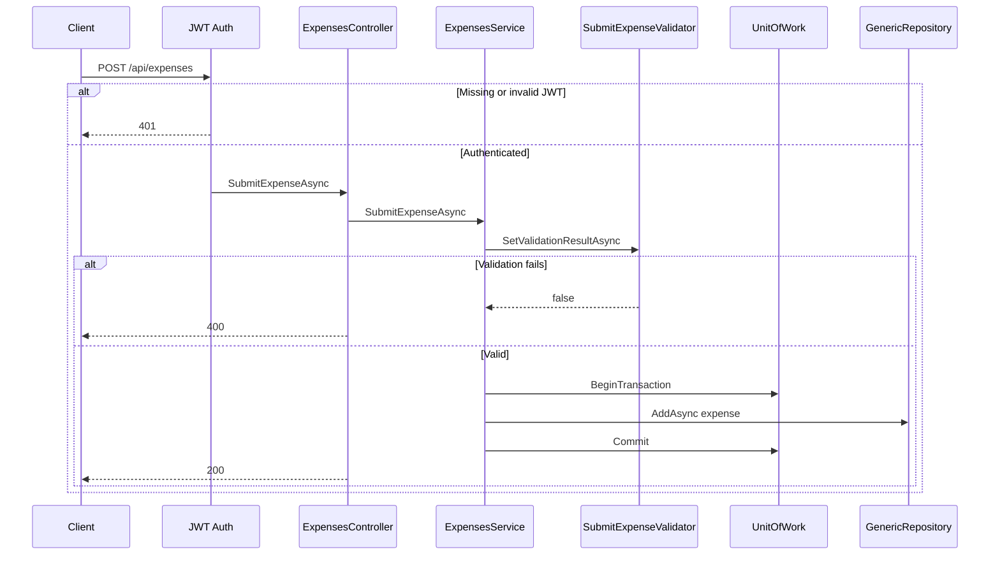

### Sequence: POST /api/expenses/{id}/approve

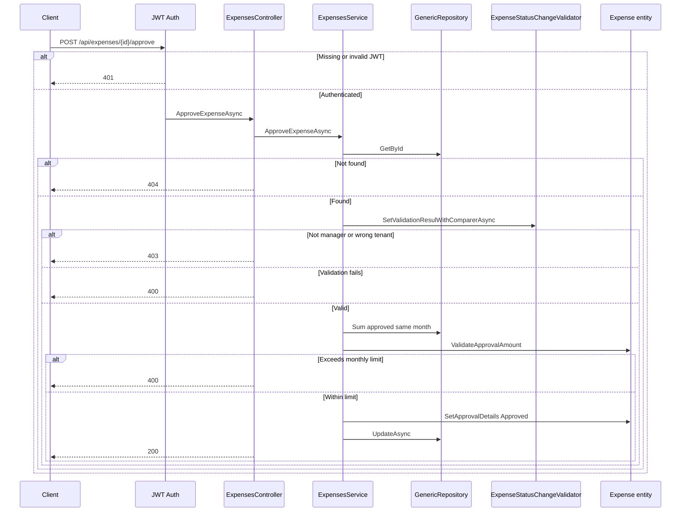

### Sequence: POST /api/expenses/{id}/reject

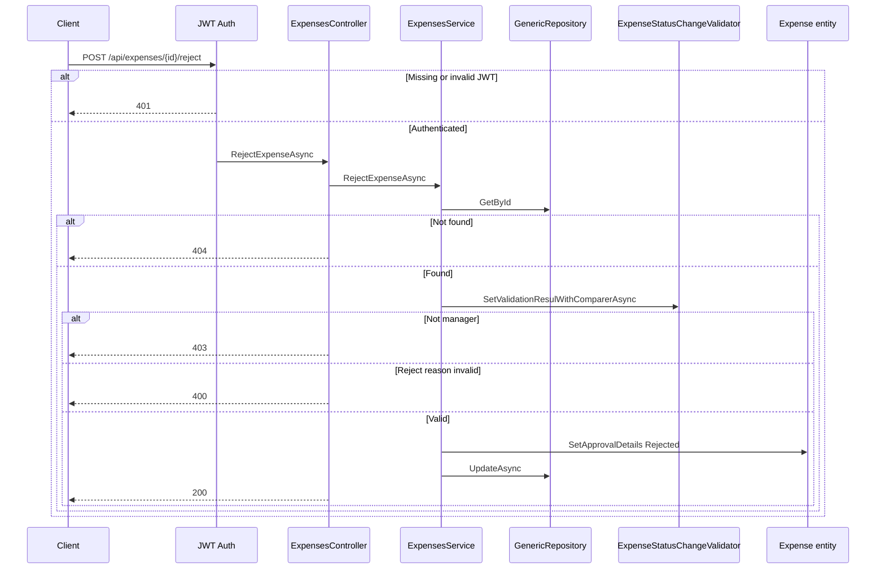

### Sequence: GET /api/expenses

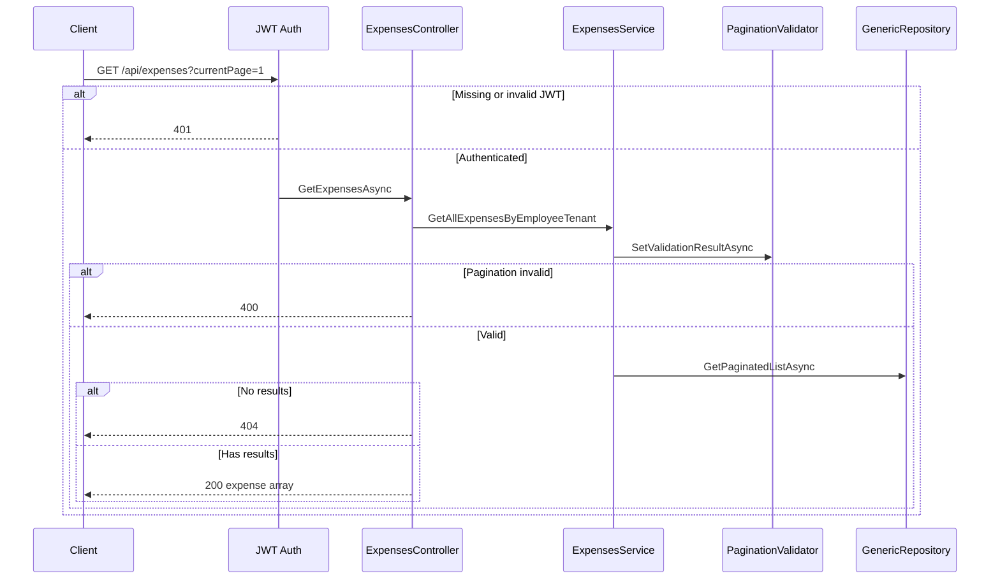

### Sequence: GET /api/expenses/{id}

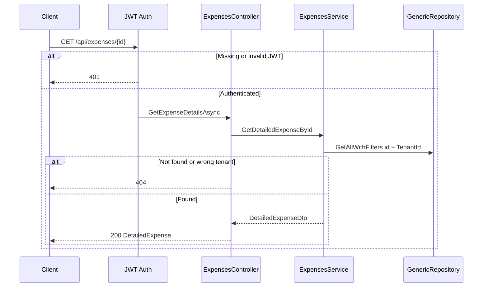

---

## Testing

```powershell
# Unit tests (Application layer business rules, validators, services)
dotnet test ER.Application.UnitTests/ER.Application.UnitTests.csproj

# Integration tests (full HTTP pipeline with InMemory DB)
dotnet test ER.IntegrationTests/ER.IntegrationTests.csproj

# All test projects
dotnet test ExpenseReports.sln
```

Integration tests use a `Testing` environment where login rate limiting is disabled and HTTPS redirection is skipped.
